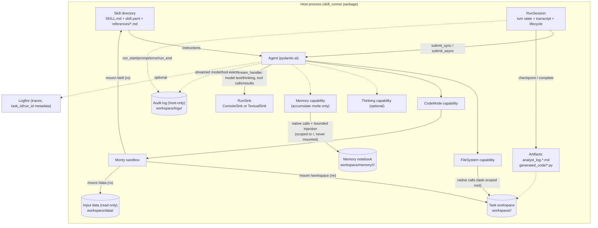
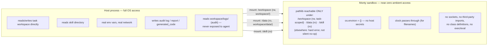

# Architecture

This document describes the system's components, how they relate, and where its trust
boundaries sit. It does not cover installation or CLI usage (see `README.md`), the specific
pydantic-ai/harness/Monty API calls and why each was chosen (see `PYDANTIC-STACK.md`), or the
history of how it got this way (see `PROJECT.md`).

## System in one sentence

A single long-lived host process (`skill_runner/runner.py`) drives an LLM agent whose instructions come
entirely from a **skill** directory, gives it two independent ways to touch the world — native
filesystem tools and a sandboxed code-execution tool — and writes everything the agent produces
back out as durable, human-readable artifacts.

## Components

### Runner (`skill_runner` package)

`skill_runner/runner.py` is the thin CLI entrypoint behind `skill-runner`: argparse (including the
shared `[skill_dir] prompt` positional grammar and `--ui`), the Textual optional-dependency guard,
and dispatch to one of two UI drivers. The application code behind it is divided by lifecycle:

- **`config.py`** converts argparse into immutable `RunOptions` and normalizes either supported
  `models.yaml` shape into one `ModelCatalog`.
- **`run_core.py`** prepares the secure workspace, skill prompt, capabilities, agent, inventory
  prefix, and narrow `RunSetup` handoff. If setup fails after audit creation it writes a failed
  `run_end`, closes the audit, and restores the previous SIGTERM handler before re-raising.
- **`session.py`** owns the agent loop, first-turn prompt prefix, transcript, state transitions,
  post-turn lint/artifact policy, errors and interruptions, and final audit closure. UI drivers
  submit prompts but do not mutate the workspace or manage run lifecycle themselves. Also enforces
  the three stuck-run safeguards per turn: `--max-retries` (passed to `CodeMode`, `run_core.py`),
  `--max-turns` (`UsageLimits.request_limit`, passed to `agent.run`/`run_sync`), and
  `--max-run-seconds` (a wall-clock watchdog started before and cancelled after each turn — see
  `audit.py` below).
- **`artifacts.py`** owns the structured `Turn`/`Transcript` model, pure report rendering, and
  durable report/generated-code writes.
- **`audit.py`** owns the append-only log, translates streamed pydantic-ai events into the shared
  sink/audit vocabulary, and provides `start_turn_watchdog()` — a background timer that delivers
  the process its own `SIGTERM` if a turn exceeds `--max-run-seconds`, deliberately reusing the
  SIGTERM-to-`RunInterrupted` plumbing below rather than a second interruption mechanism.

None of these modules contains analysis logic or knows what a "suspicious SNI" is. All domain
knowledge lives in skills.

#### Two UI backends, one `RunSink` contract

`--ui console` (default) and `--ui textual` are two independent *observers* of the same run —
neither produces different artifacts or a different event vocabulary, they just render it
differently:

- **`skill_runner/console_ui.py`** (`ConsoleSink`, `run_console`) — today's behavior: raw `print()`s to a flat
  terminal, plus a blocking `input()` checkpoint loop under `--interactive`. Still calls
  `agent.run_sync` synchronously; nothing here is async.
- **`skill_runner/ui_textual.py`** (`TextualSink`, `AnalystApp`, `run_textual`) — a multi-panel TUI (a
  `DataTable` pairing tool calls with their results by `tool_call_id`, a `RichLog` for model
  text/thinking, a live `DirectoryTree` of the task workspace, and a bottom `Input` bar that
  always accepts free-text follow-ups). Drives the agent with `await agent.run(...)` inside a
  Textual `@work` coroutine, on the App's own asyncio loop — never `run_sync`, never a thread.
  Reusable tables and modal screens live in `skill_runner/tui_widgets.py`; the entire Textual
  surface is imported lazily, only when `--ui textual` is selected, so a console-only install
  never imports `textual`.

Both sinks implement the same `RunSink` protocol (`status(message)` for one-off lines,
`emit(kind, **fields)` for the same event vocabulary `AuditLog.event` persists). `RunSession`
constructs `make_event_stream_handler(audit, sink)`, so every streamed event reaches both audit
and UI with identical fields. A multi-turn Textual session checkpoints the same
`analyst_log-<run_stamp>.md` after every successful turn from its structured `Transcript`; a
failed or interrupted turn leaves the prior checkpoint intact.

SIGTERM handling differs by necessity between the two: console mode relies on `skill_runner/audit.py`'s raw
`signal.signal(SIGTERM, ...)` handler, which raises straight through the blocking `run_sync`
call. Under Textual, that same raw handler can instead land inside asyncio's own internals
(observed during testing landing mid-`select()`) rather than inside the running turn's
coroutine — so `AnalystApp` takes over `SIGTERM` via `asyncio`'s own `add_signal_handler` once
mounted, resolving any delivery to a clean, deterministic `self.exit()` regardless of whether a
turn is active.

### Skill (`skills/<name>/`)

A skill is a self-contained bundle of expertise, not code:

- `SKILL.md` — the system prompt, verbatim. No templating layer sits between this file and the
  model; the skill *is* the prompt.
- `skill.yaml` (optional) — structured metadata (name, description, version, tags) alongside the
  instructions.
- `references/*.md` — domain reference material (e.g. a log format's field dictionary) the
  skill's instructions point the model at, but which isn't part of the prompt itself — it's
  fetched on demand from inside the sandbox.

Two skills exist today (`suricata-analyst`, `osqueryd-analyst`), each analyzing a different log
format. They are structurally identical: same section layout in `SKILL.md`, same
discover-then-analyze workflow shape, same reusable-script naming convention (a skill-specific
prefix). The runner has no knowledge of either skill's domain — it only knows "load whatever
`SKILL.md`/`skill.yaml` says," which is what makes adding a third skill a content-only change.

### Shared runtime notes (`prompts/sandbox_notes.md`)

Instructions that are true for *every* skill because they describe the execution environment,
not any log format: sandbox constraints, the four path namespaces, the script-reuse mechanism,
artifact-naming conventions. This is prepended to every skill's own instructions at load time so
each skill only has to document what's actually specific to it — the alternative (repeating
sandbox mechanics inside every `SKILL.md`) is exactly the duplication this file exists to avoid.

### Agent (pydantic-ai)

The component that owns the model connection, the system prompt, and the tool-calling loop.
Everything else in the system — tools, sandboxing, reasoning effort — is expressed as a
*capability* plugged into this one object, rather than as separate infrastructure the runner
manages by hand.

### Capabilities

Up to four capabilities compose to define what the agent can actually do, each independent of the
others:

- **`FileSystem`** — ordinary, native tools (list/read/write/search) scoped to the current task's
  workspace directory (`workspace/<task>/`), never the workspace base. This is how the agent
  inspects and persists artifacts without writing code — and, structurally, it cannot see
  `workspace/data/` or `workspace/logs/` or any other task's directory, because its root never
  points above `workspace/<task>/`.
- **`CodeMode`** — replaces however many tools would otherwise be sandboxed with a single
  `run_code` tool that accepts Python source. In this system it sandboxes *zero* of the other
  tools (`FileSystem`'s tools stay native); `run_code` exists purely as a Python execution
  surface for log analysis, not as a wrapper around other capabilities. This is a deliberate,
  non-default configuration choice — see `PYDANTIC-STACK.md` §4 for why.
- **`Thinking`** (conditional) — requests extended reasoning from the model. Unlike the other
  two, it doesn't gate or wrap anything else; it's purely additive and only present when
  requested.
- **`Memory`** (accumulate mode only) — a persistent, per-`<skill>/<task>` `MEMORY.md` notebook,
  auto-injected into every model request (bounded, ~2k tokens) plus `read_memory`/`write_memory`/
  `search_memory` tools for longer topic files. Backed by `pydantic_ai_harness.memory.FileStore`,
  rooted at `workspace/memory/` — never mounted into the sandbox and never rooted by
  `FileSystem`, so it's reachable only through its own native tools, the same way `FileSystem`'s
  tools stay native rather than routing through `CodeMode`. Omitted entirely (not merely given an
  empty notebook) in pristine mode, so a pristine run's tool surface and prompt token count are
  identical regardless of whether the same task was ever run before — see "Workspace" below and
  `refs/workspace-lifecycle.md`.

### Monty sandbox

The interpreter behind `run_code`. Structurally, it is the system's actual security boundary:
a from-scratch Python-subset interpreter (not a subprocess or container) with its own type
checker, a fixed importable stdlib subset, no class definitions, and no host filesystem/env/clock
access except what's explicitly granted. Two things are granted, each independently:

- **Mounted directories** — the task workspace (read-write), the case's input data (read-only),
  and the current skill's own directory (read-only). These are the *only* three paths reachable
  from inside sandboxed code.
- **OS access** — environment variables are scrubbed to empty; the host clock is exposed (needed
  for timestamped filenames).

Everything the sandbox can do is enumerated by these two grants — there is no ambient access to
fall back on.

### Workspace

`--workspace` (default `./workspace`) is the case root, containing four domains — see
[`refs/workspace-lifecycle.md`](refs/workspace-lifecycle.md) for the full design this section
summarizes:

- **`data/`** — canonical, caller-supplied input evidence. Read-only, shared across tasks
  (including pristine ones), mounted at `/data`. Not agent state.
- **`<task>/`** — the one stateful, agent-writable directory, and the join point between three
  different views of the same directory: `FileSystem` tools see it as their root (relative
  paths), `run_code` sees it mounted at `/workspace` (read-write), and the host process reads/
  writes it directly (generated code, reports). Which task directory is selected — a shared
  `default`, a named `--task` that accumulates, or a fresh `--pristine` one — is resolved once at
  startup. It also carries state *across* runs: prior `analyst_log-*.md` reports and
  previously-saved `<prefix>_*.py` scripts left by earlier sessions in the *same* task are
  discovered and surfaced to the agent at the start of each new run, so investigations accumulate
  rather than restarting cold every time — unless a fresh `--pristine` task was requested.
- **`memory/`** — a flat, per-`<skill>/<task>` notebook domain, nested one level deeper than
  `logs/` (by skill, then task). Agent-authored, like reusable scripts, but reachable only
  through the `Memory` capability's own tools and its bounded automatic injection — never through
  `FileSystem` or a mount. Accumulates identically to scripts in accumulate mode; the capability
  is omitted entirely in pristine mode, so no scope for that task ever exists.
- **`logs/`** — a flat, host-only audit domain (see below), a sibling of the task directories and
  therefore outside every task's writable root.

The isolation guarantee — an agent in one task can never read another task's directory or the
audit log — holds only because the task root stays a validated, real, direct child of the
workspace base; see `refs/workspace-lifecycle.md` for the invariants a future refactor must
preserve. `Memory`'s scope isolation is a separate, complementary guarantee: every operation is
prefixed server-side by `<skill>/<task_id>`, so one shared store root can't leak notes across
tasks even though it isn't filesystem-mount-based like the other three domains.

### Audit log (`workspace/logs/`)

An append-only, host-only JSON Lines event stream, one file per run
(`runner-<task>-<run-id>.jsonl`), a flat sibling of the task directories — not nested inside any
of them, which is what keeps it unreachable through `FileSystem` or the sandbox's mounts. Unlike
the old console transcript it replaces, events (configuration, prompts, every tool call/result,
`run_code` bodies and returns, errors, completion) are flushed as they happen via pydantic-ai's
`event_stream_handler`, so a failed or interrupted run still leaves a complete record.

Two hardening details address the "Retention and permissions" open item in
`refs/workspace-lifecycle.md`:

- **Permissions.** `workspace/logs/` is `chmod 0700` and each `.jsonl` file `0600` at creation,
  re-applied on every run rather than only on first creation, since audit records can contain
  prompts, tool data, generated code, model responses, and reasoning — the umask defaults
  (`0755`/`0644`) are not restrictive enough for that on their own.
- **SIGTERM.** A `Ctrl+C` (`KeyboardInterrupt`) already unwinds through Python's normal
  `finally`, so `run_end` gets written. A hard `SIGTERM` (e.g. a process manager's timeout, not a
  user's interactive interrupt) previously did not — Python installs no default handler for it,
  so the process died before the audit log closed. The runner now converts `SIGTERM` into a
  catchable `RunInterrupted` exception, which the `finally` block treats the same way, and exits
  `143` (the standard `128 + SIGTERM` code) to signal the process was terminated. `SIGKILL`
  remains uncatchable by any process — an OS-level limit, not something this addresses. This
  mapping must be caught in `runner.py`'s `main()` itself, not only under `if __name__ ==
  "__main__":` — the installed `skill-runner` console-script entry point calls `main()` directly
  and never runs through that guard, so a version living only there silently never fires for the
  primary way this tool is actually invoked (`ISSUES.md` #13).
- **`--max-run-seconds`.** A stuck turn (no forward progress at all — a hung network request, as
  opposed to a slow-but-working one) gets the identical clean shutdown as an external `SIGTERM`:
  `audit.py`'s `start_turn_watchdog()` starts a background timer per turn that delivers the
  process its own `SIGTERM` on overrun, letting the same conversion/`finally`/exit-143 path above
  handle it, rather than adding a second interruption mechanism. The timer is cancelled once the
  turn finishes on its own.

### Observability (Logfire, optional)

An orthogonal, opt-in layer that instruments the agent to emit spans for model calls and tool
executions. It doesn't participate in the data flow above — it observes it. Its main structural
value is making capability composition (e.g. whether a tool call landed as a sibling of
`run_code` or a child of it) empirically checkable rather than something only inferable from
reading configuration.

## Trust boundaries

There are exactly two privilege domains, and the mounts/env grants are the entire membrane
between them:

`FileSystem` tool calls never cross into the sandbox at all — they're native calls the model
issues directly against the host-side task workspace path. `run_code` is the only surface that
crosses into the sandbox, and everything it can touch is enumerated above. There is no path by
which model-generated code reaches host secrets, the network, another task's directory,
`workspace/logs/`, or any file outside the three mounted directories, regardless of what the
model's own instructions or the user's prompt ask for — the guarantee is structural (interpreter
+ mount table + task-root validation), not something a skill's wording could accidentally weaken.
See "Isolation guarantee" in `refs/workspace-lifecycle.md` for the specific invariants this
depends on (validated task roots, reserved names, no symlink/traversal task ids).

`Memory` (when attached) is a second native, non-sandboxed surface alongside `FileSystem` — the
model reaches `workspace/memory/<skill>/<task>/` only through its own tool calls and automatic
injection, never through a mount, so it doesn't add a fourth sandbox mount to the diagram above.
Its isolation instead comes from server-side scope prefixing (`<skill>/<task_id>`), enforced by
the store itself rather than by `pathlib`/mount-table restriction — the same class of guarantee,
different mechanism.

## Extension points

- **New skill** = new directory under `skills/`, no runner changes. The runner generalizes over
  skills entirely through the `SKILL.md`/`skill.yaml`/`references/` convention.
- **New capability** (e.g. a future tool that should be *sandboxed* rather than native) is added
  to the `capabilities` list and, if it should run inside `run_code`, included in `CodeMode`'s
  tool selector — today that selector is empty by design, but it accepts a predicate, so a mixed
  native/sandboxed toolset is a configuration change, not a redesign.
- **New reference material** for a skill is picked up automatically the moment it's added under
  that skill's `references/`, since the read-only mount is keyed off the skill directory as a
  whole, not individual files.
