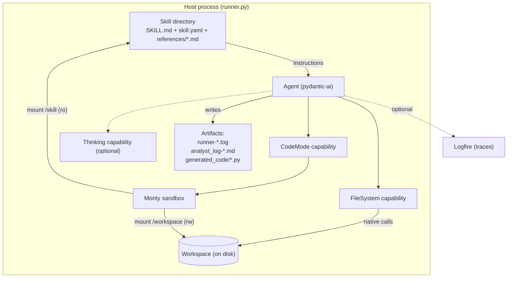
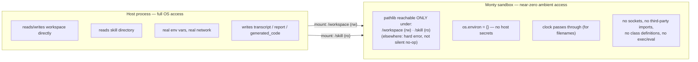

# Architecture

This document describes the system's components, how they relate, and where its trust
boundaries sit. It does not cover installation or CLI usage (see `README.md`), the specific
pydantic-ai/harness/Monty API calls and why each was chosen (see `PYDANTIC-STACK.md`), or the
history of how it got this way (see `PROJECT.md`).

## System in one sentence

A single long-lived host process (`runner.py`) drives an LLM agent whose instructions come
entirely from a **skill** directory, gives it two independent ways to touch the world — native
filesystem tools and a sandboxed code-execution tool — and writes everything the agent produces
back out as durable, human-readable artifacts.

## Components

### Runner (`runner.py`)

The only long-lived process. It has four responsibilities, and nothing else:

1. **Assembles** a skill's instructions + shared runtime notes into one system prompt, and wires
   up the agent's capabilities.
2. **Drives** the agent loop (`agent.run_sync`), including the optional interactive
   checkpoint/continuation loop.
3. **Persists** everything the run produced — transcript, generated code, final report — as
   plain files, independent of whether the model chose to save anything itself.
4. **Maintains** the workspace between runs: linting previously-saved scripts for sandbox
   incompatibilities, and telling the agent what already exists there before it starts.

It contains no analysis logic itself — it never parses a log file or knows what a "suspicious
SNI" is. All domain knowledge lives in skills.

### Skill (`skills/<name>/`)

A skill is a self-contained bundle of expertise, not code:

- `SKILL.md` — the system prompt, verbatim. No templating layer sits between this file and the
  model; the skill *is* the prompt.
- `skill.yaml` (optional) — structured metadata (name, description, version, tags) alongside the
  instructions.
- `references/*.md` — domain reference material (e.g. a log format's field dictionary) the
  skill's instructions point the model at, but which isn't part of the prompt itself — it's
  fetched on demand from inside the sandbox.

Two skills exist today (`suricata-analyst`, `osqueryd-analyst`), each analyzing a different log
format. They are structurally identical: same section layout in `SKILL.md`, same
discover-then-analyze workflow shape, same reusable-script naming convention (a skill-specific
prefix). The runner has no knowledge of either skill's domain — it only knows "load whatever
`SKILL.md`/`skill.yaml` says," which is what makes adding a third skill a content-only change.

### Shared runtime notes (`prompts/sandbox_notes.md`)

Instructions that are true for *every* skill because they describe the execution environment,
not any log format: sandbox constraints, the three path namespaces, the script-reuse mechanism,
artifact-naming conventions. This is prepended to every skill's own instructions at load time so
each skill only has to document what's actually specific to it — the alternative (repeating
sandbox mechanics inside every `SKILL.md`) is exactly the duplication this file exists to avoid.

### Agent (pydantic-ai)

The component that owns the model connection, the system prompt, and the tool-calling loop.
Everything else in the system — tools, sandboxing, reasoning effort — is expressed as a
*capability* plugged into this one object, rather than as separate infrastructure the runner
manages by hand.

### Capabilities

Three capabilities compose to define what the agent can actually do, each independent of the
others:

- **`FileSystem`** — ordinary, native tools (list/read/write/search) scoped to the workspace
  directory. This is how the agent inspects and persists artifacts without writing code.
- **`CodeMode`** — replaces however many tools would otherwise be sandboxed with a single
  `run_code` tool that accepts Python source. In this system it sandboxes *zero* of the other
  tools (`FileSystem`'s tools stay native); `run_code` exists purely as a Python execution
  surface for log analysis, not as a wrapper around other capabilities. This is a deliberate,
  non-default configuration choice — see `PYDANTIC-STACK.md` §4 for why.
- **`Thinking`** (conditional) — requests extended reasoning from the model. Unlike the other
  two, it doesn't gate or wrap anything else; it's purely additive and only present when
  requested.

### Monty sandbox

The interpreter behind `run_code`. Structurally, it is the system's actual security boundary:
a from-scratch Python-subset interpreter (not a subprocess or container) with its own type
checker, a fixed importable stdlib subset, no class definitions, and no host filesystem/env/clock
access except what's explicitly granted. Two things are granted, each independently:

- **Mounted directories** — the workspace (read-write) and the current skill's own directory
  (read-only). These are the *only* two paths reachable from inside sandboxed code.
- **OS access** — environment variables are scrubbed to empty; the host clock is exposed (needed
  for timestamped filenames).

Everything the sandbox can do is enumerated by these two grants — there is no ambient access to
fall back on.

### Workspace

The one stateful, shared location in the whole system, and the join point between three
different views of the same directory:

- `FileSystem` tools see it as their root (relative paths).
- `run_code` sees it mounted at `/workspace` (read-write).
- The host process sees it as an ordinary directory it reads/writes directly (transcript,
  generated code, reports).

It also carries state *across* runs, not just within one: prior `analyst_log-*.md` reports and
previously-saved `<prefix>_*.py` scripts left by earlier sessions are discovered and surfaced to
the agent at the start of each new run, so investigations accumulate rather than restarting cold
every time.

### Observability (Logfire, optional)

An orthogonal, opt-in layer that instruments the agent to emit spans for model calls and tool
executions. It doesn't participate in the data flow above — it observes it. Its main structural
value is making capability composition (e.g. whether a tool call landed as a sibling of
`run_code` or a child of it) empirically checkable rather than something only inferable from
reading configuration.

## Trust boundaries

There are exactly two privilege domains, and the mounts/env grants are the entire membrane
between them:

`FileSystem` tool calls never cross into the sandbox at all — they're native calls the model
issues directly against the host-side workspace path. `run_code` is the only surface that
crosses into the sandbox, and everything it can touch is enumerated above. There is no path by
which model-generated code reaches host secrets, the network, or any file outside the two
mounted directories, regardless of what the model's own instructions or the user's prompt ask
for — the guarantee is structural (interpreter + mount table), not something a skill's wording
could accidentally weaken.

## Extension points

- **New skill** = new directory under `skills/`, no runner changes. The runner generalizes over
  skills entirely through the `SKILL.md`/`skill.yaml`/`references/` convention.
- **New capability** (e.g. a future tool that should be *sandboxed* rather than native) is added
  to the `capabilities` list and, if it should run inside `run_code`, included in `CodeMode`'s
  tool selector — today that selector is empty by design, but it accepts a predicate, so a mixed
  native/sandboxed toolset is a configuration change, not a redesign.
- **New reference material** for a skill is picked up automatically the moment it's added under
  that skill's `references/`, since the read-only mount is keyed off the skill directory as a
  whole, not individual files.
