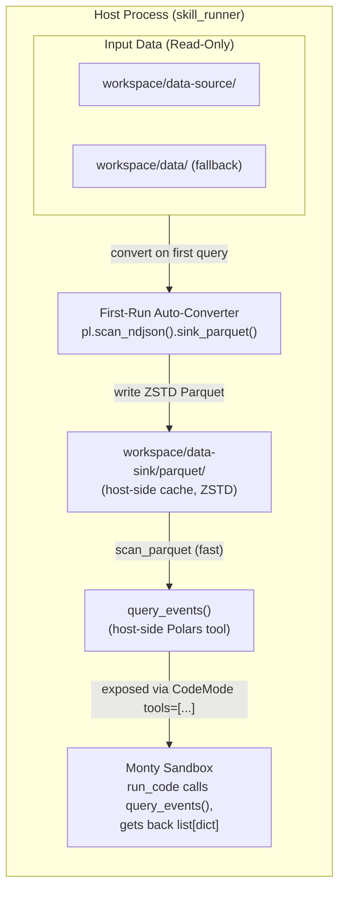

# Technical Implementation Plan: `data-source`, `data-sink` & Parquet Conversion in `pydantic-security-skills`

This document details the plan to integrate dual data-source resolution, a one-time first-run
Parquet cache, and a **host-side Polars query tool** into `skill_runner`. It is Polars-only: no
DuckDB, no model-authored SQL. The model calls a structured, parameterized tool from inside the
Monty sandbox; the tool runs Polars on the host and returns rows as `list[dict]`.

---

## 1. High-Level Architecture & Principles

### System Flow


### Principles
- **No SQL, no code surface.** The model passes typed filters (`event_type`, `columns`, `limit`),
  never a query string. There is no `read_*()`/`COPY TO` filesystem surface to harden.
- **The model never supplies a path.** It passes a *logical name*; the host maps it to the cache
  path. Path resolution and traversal defense live in one place (`ensure_parquet_cache`).
- **The Parquet cache is host-side only.** It is *not* mounted into the sandbox — the sandbox has
  no Polars and cannot read Parquet. The tool reads it host-side and returns dicts.
- **Additive, not a replacement.** Skills can still read raw NDJSON line-by-line from `/data`;
  `query_events` is a faster optional path for large files.

---

## 2. Directory Layout & Mount Map

### Directory Structure
```text
workspace/
├── data-source/             <-- Primary read-only input (e.g. eve-2026-01-06-01.json)
├── data/                    <-- Fallback read-only input (legacy compatibility)
├── data-sink/
│   └── parquet/             <-- Host-side ZSTD Parquet cache (NOT mounted into the sandbox)
├── task-<uuid>/             <-- Task workspace (/workspace mount)
├── logs/                    <-- Host audit logs
└── memory/                  <-- Agent memory store
```

### Sandbox Mount Configurations (`run_core.py`)
| Virtual Mount Path | Host Source Directory | Permission | Purpose |
| :--- | :--- | :--- | :--- |
| `/data-source` | `workspace/data-source/` (or fallback `workspace/data/`) | `read-only` | Immutable raw log files |
| `/data` *(alias)* | same resolved dir as `/data-source` | `read-only` | Backwards compatibility for existing skills/prompts |
| `/workspace` | `workspace/<task_id>/` | `read-write` | Task-scoped scratch, scripts, reports |
| `/skill` | `<skill_path>` | `read-only` | Active skill instructions & reference docs |

`workspace/data-sink/` is **not** in this table on purpose — it is a host-side cache accessed only
by `query_events`, never mounted into Monty. Sandbox output still goes to `/workspace`.

---

## 3. On-First-Run Auto-Conversion Logic

Conversion is **lazy** — it happens the first time `query_events` needs the cache, not during
workspace prep (`_prepare_workspace` only creates the empty `data-sink/parquet/` directory).

When `query_events(name=...)` is called for a log file (e.g. `eve-2026-01-06-01.json`):

1. **Name validation:** reject anything that isn't a bare filename (no path separators, no `.`/`..`,
   no absolute paths). See §4E.
2. **Resolution:** check `workspace/data-source/<name>`; if absent, fall back to
   `workspace/data/<name>`. If neither exists, raise.
3. **Cache verification:** check for `workspace/data-sink/parquet/<stem>.parquet`.
4. **On first run (Parquet missing):** stream-convert NDJSON to Parquet — Polars `scan_ndjson`
   is lazy, so the 184 MB source is never loaded whole:
   ```python
   import polars as pl

   pl.scan_ndjson(source_path).sink_parquet(sink_parquet_path, compression="zstd")
   ```
5. **Subsequent runs:** queries scan the cached Parquet directly for far faster repeat reads and
   a large on-disk size reduction.

---

## 4. Code Changes Breakdown

### A. Dependencies (`pyproject.toml`)
Add **only** `polars`:
```toml
dependencies = [
    "anyio>=4.0",
    "logfire[system-metrics]>=4.37.0",
    "polars>=1.0.0",
    "pydantic-ai>=2.9.1",
    "pydantic-ai-harness[codemode]>=0.7.0",
    "pyyaml>=6.0.3",
]
```
> Confirm a cp314 Polars wheel is available (the project pins `requires-python = ">=3.14"`) before
> committing, otherwise `uv sync` breaks on a source build.

### B. New Module: Data Tools (`skill_runner/data_tools.py`)
Two host functions. Only `query_events` is exposed to the model; `ensure_parquet_cache` is internal.

* **`ensure_parquet_cache(name: str, source_root: Path, cache_root: Path, fallback_root: Path) -> Path`**
  — validates `name`, resolves the source (data-source → data fallback), converts to Parquet on
  first run, returns the cache path.
* **`query_events(name: str, event_type: str | None = None, columns: list[str] | None = None, limit: int = 100) -> list[dict]`**
  — the model-facing tool:
  ```python
  def query_events(name, event_type=None, columns=None, limit=100):
      path = ensure_parquet_cache(name, ...)      # logical name -> host path (validated)
      lf = pl.scan_parquet(path)
      if event_type is not None:
          lf = lf.filter(pl.col("event_type") == event_type)
      if columns:
          lf = lf.select(columns)
      return lf.head(limit).collect().to_dicts()
  ```
  The `source_root`/`cache_root`/`fallback_root` paths are bound host-side (e.g. via
  `functools.partial` or a small closure in `_build_agent`) so the model only ever passes
  `name`/`event_type`/`columns`/`limit`. The closure's `__name__` must be `query_events` (or set
  it explicitly) — that string is the tool name CodeMode selects on in §4C.3.

### C. Runner Updates (`skill_runner/run_core.py`)
1. `_prepare_workspace()` resolves `data-source` (with `data` fallback) and creates
   `data-sink/parquet/` (empty; conversion is lazy). Add both new names to `RESERVED_TASK_NAMES`
   (see §4E) and to `WorkspaceContext`.
2. `_build_agent()` adds the `/data-source` (ro) and `/data` alias (ro) mounts. It does **not**
   mount `data-sink`.
3. Wire `query_events` in two steps (verified against `pydantic_ai_harness.code_mode`):
   - **Register it as an Agent tool** — add the bound `query_events` closure to `Agent(tools=[...])`
     so it exists in the toolset under the name `query_events`. `CodeMode.tools` is a *name
     selector*, not a place to pass function objects.
   - **Select it into the sandbox by name**: change `CodeMode(tools=[])` to
     `CodeMode(tools=['query_events'])`. The selector sandboxes only the listed names and leaves
     everything else native (`_capability.py:39-40`), so `FileSystem`'s native tools are preserved
     automatically — the Phase 2 fix (`IMPL.md:115`) still holds. Do **not** use `tools='all'`
     (that would fold `FileSystem` behind `run_code`).
   - The sandboxed tool's typed signature is rendered into the `run_code` tool description
     (`_toolset.py:279`), which is how the model learns to call `query_events(...)` from inside
     `run_code` — no separate stub authoring needed. Keep the signature simple and fully typed.

### D. Prompt & Skill Documentation (`prompts/sandbox_notes.md`)
Document that `query_events(name, event_type=..., columns=..., limit=...)` is callable from
`run_code` and returns a list of dict rows already parsed host-side — so for large files the model
should prefer it over hand-rolled line-by-line NDJSON parsing, then aggregate the returned rows
in-sandbox. Note the sandbox still cannot import `polars`; the tool runs on the host.

> **Sequencing constraint.** `sandbox_notes.md` is prepended to *every* skill run
> (`load_sandbox_notes` in `run_core.py:116`), so this text goes live the moment it lands. It must
> ship **together with** the §4B/§4C wiring — never ahead of it — or the model will be told about a
> `query_events` tool it cannot actually call. Land the prompt edit and the tool registration in
> the same change (or gate the prompt text until the tool exists).

### E. Name validation & reserved names
* Validate `name` against a bare-filename pattern (reuse the spirit of `TASK_ID_RE`): reject path
  separators, `.`/`..`, and absolute paths, so a malicious `name` cannot escape `data-source`/`data`.
* Add `"data-source"` and `"data-sink"` to `RESERVED_TASK_NAMES` in `run_core.py:32` so a
  `--task data-sink` can't collide with the new top-level workspace directories.

---

## 5. Verification Plan

Per project convention, tests assert **behavior**, not latency numbers.

1. **Unit Tests (`tests/test_data_tools.py`):**
   * Input resolution: `data-source` preferred, `data` used as fallback, missing file raises.
   * Name validation: `../../etc/passwd`, absolute paths, and names with separators are rejected.
   * Conversion: a small mock NDJSON is converted to `<stem>.parquet` on first call.
   * Caching: a second call does **not** re-convert (assert mtime unchanged / no second write).
   * Query: `query_events` filters by `event_type`, honors `columns`/`limit`, returns `list[dict]`.
2. **Integration Test:**
   * Run `skill-runner` against `workspace/data/eve-2026-01-06-01.json`.
   * Assert `workspace/data-sink/parquet/eve-2026-01-06-01.parquet` is created on first query.
   * Assert the second query reads the Parquet cache (path scanned is the `.parquet`, not the
     `.json`) — behavior, not a millisecond threshold.
