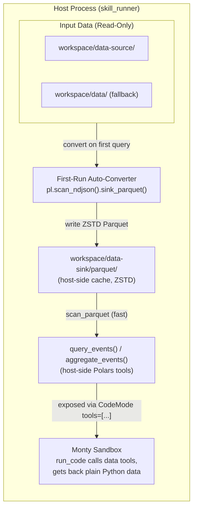

# Technical Implementation Plan: `data-source`, `data-sink` & Parquet Conversion in `pydantic-security-skills`

This document details the plan to integrate one-time data-source selection, a validated Parquet
cache, and **host-side Polars query tools** into `skill_runner`. It is Polars-only: no DuckDB, no
model-authored SQL. The model calls structured, parameterized tools from inside the Monty sandbox;
the tools run Polars on the host and return bounded row pages or exact aggregate results as plain
Python data.

---

## 1. High-Level Architecture & Principles

### System Flow


### Principles
- **No SQL or model-authored query language.** The model passes typed filters, pagination, and
  grouping fields, never a query string. There is no `read_*()`/`COPY TO` filesystem surface to
  harden.
- **The model never supplies a path.** It passes a *logical name*; the host maps it to the cache
  path. Path resolution and traversal defense live in one place (`ensure_parquet_cache`).
- **One source root per run.** Startup selects `workspace/data-source/` when it already exists;
  otherwise it selects the legacy `workspace/data/`. Mounts, inventory, conversion, and queries all
  use that same resolved root. There is no per-file union or fallback across the two directories.
- **The Parquet cache is host-side only.** It is *not* mounted into the sandbox — the sandbox has
  no Polars and cannot read Parquet. The tool reads it host-side and returns dicts.
- **Additive, not a replacement.** Skills can still read raw NDJSON line-by-line from `/data`;
  the data tools are faster optional paths for large files.
- **Bounded detail, exact aggregates.** `query_events` returns a capped page for inspection;
  `aggregate_events` computes counts over the complete filtered dataset on the host. The model must
  not infer whole-file statistics from a row page.

---

## 2. Directory Layout & Mount Map

### Directory Structure
```text
workspace/
├── data-source/             <-- Primary read-only input (e.g. eve-2026-01-06-01.json)
├── data/                    <-- Fallback read-only input (legacy compatibility)
├── data-sink/
│   └── parquet/             <-- Host-side ZSTD Parquet cache (NOT mounted into the sandbox)
├── task-<uuid>/             <-- Task workspace (/workspace mount)
├── logs/                    <-- Host audit logs
└── memory/                  <-- Agent memory store
```

### Sandbox Mount Configurations (`run_core.py`)
| Virtual Mount Path | Host Source Directory | Permission | Purpose |
| :--- | :--- | :--- | :--- |
| `/data-source` | active source root selected once at startup | `read-only` | Immutable raw log files |
| `/data` *(alias)* | same resolved dir as `/data-source` | `read-only` | Backwards compatibility for existing skills/prompts |
| `/workspace` | `workspace/<task_id>/` | `read-write` | Task-scoped scratch, scripts, reports |
| `/skill` | `<skill_path>` | `read-only` | Active skill instructions & reference docs |

`workspace/data-sink/` is **not** in this table on purpose — it is a host-side cache accessed only
by the data tools, never mounted into Monty. Sandbox output still goes to `/workspace`.

### Source-root selection

`_prepare_workspace()` applies one deterministic policy before building the inventory or agent:

1. If `workspace/data-source/` already exists as a real, non-symlink directory, select it.
2. Otherwise create or reuse `workspace/data/` as a real, non-symlink directory and select it.
3. If either reserved path exists with the wrong type or resolves outside the workspace base, fail
   setup. Do not silently follow it and do not fall back around an unsafe primary path.

When both directories exist, `data-source/` wins for the entire run; files present only in `data/`
are intentionally unavailable. The startup inventory, `/data-source`, `/data`, cache conversion,
and both Polars tools receive the same `WorkspaceContext.source_root`.

---

## 3. On-First-Run Auto-Conversion Logic

Conversion is **lazy** — it happens the first time either data tool needs the cache, not during
workspace prep (`_prepare_workspace` only creates the empty `data-sink/parquet/` directory).

When `query_events(name=...)` is called for a log file (e.g. `eve-2026-01-06-01.json`):

1. **Name validation:** reject anything that isn't a bare filename (no path separators, no `.`/`..`,
   no absolute paths). See §4E.
2. **Contained source resolution:** join `name` to the already-selected source root, reject symlinks
   and non-regular files, resolve it, and require its resolved parent to equal the resolved source
   root. There is no second-root lookup at query time.
3. **Cache identity:** stat the source and derive an opaque cache key from the source-root identity,
   complete filename (not `Path.stem`), device/inode, byte size, and nanosecond mtime. This prevents
   same-stem collisions, distinguishes the primary and legacy roots, and changes the key when the
   selected evidence changes. The final path is
   `workspace/data-sink/parquet/<sha256(cache-identity)>.parquet`.
4. **Cache verification:** while holding a per-key inter-process lock, accept the final cache path
   only if it is a regular, non-symlink Parquet file. Re-check after acquiring the lock because a
   competing runner may have completed conversion while this process waited.
5. **On cache miss:** stream-convert NDJSON into a uniquely named temporary file in the validated
   cache directory — Polars `scan_ndjson` is lazy, so the 184 MB source is never loaded whole:
   ```python
   import polars as pl

   pl.scan_ndjson(source_path).sink_parquet(temp_path, compression="zstd")
   ```
6. **Publish atomically:** stat the source again after conversion. If its identity changed, discard
   the temporary file and retry from the new identity rather than publishing a mixed snapshot.
   Otherwise close/sync the temporary file and atomically replace the final path. A failed or
   interrupted conversion can leave only an ignored temporary file, never a final-looking partial
   cache. Release the lock in `finally` and remove this process's temporary file on error.
7. **Subsequent runs:** an unchanged source derives the same key and scans the completed Parquet
   directly. Old fingerprinted cache entries may be removed only by an explicit, separately scoped
   cache-cleanup operation; query code never guesses that an old entry is safe to delete.

The implementation uses a stdlib inter-process file lock (for example `fcntl.flock` on the
project's supported POSIX runtime) opened without following symlinks. It validates each
`data-sink/parquet` path component as a real directory before creating locks or temporary files.

---

## 4. Code Changes Breakdown

### A. Dependencies (`pyproject.toml`)
Add **only** `polars`:
```toml
dependencies = [
    "anyio>=4.0",
    "logfire[system-metrics]>=4.37.0",
    "polars>=1.0.0",
    "pydantic-ai>=2.9.1",
    "pydantic-ai-harness[codemode]>=0.7.0",
    "pyyaml>=6.0.3",
]
```
> Confirm a cp314 Polars wheel is available (the project pins `requires-python = ">=3.14"`) before
> committing, otherwise `uv sync` breaks on a source build.

### B. New Module: Data Tools (`skill_runner/data_tools.py`)
Three host functions. `query_events` and `aggregate_events` are exposed to the model;
`ensure_parquet_cache` is internal. Module constants cap row pages, group output, selected columns,
and grouping columns so model-controlled arguments cannot create unbounded tool results.

* **`ensure_parquet_cache(name: str, source_root: Path, cache_root: Path) -> Path`** — validates
  `name`, enforces source/cache containment and file types, derives the source-identity cache key,
  and performs locked temporary-file conversion plus atomic publication on a cache miss.
* **`query_events(name: str, event_type: str | None = None, columns: list[str] | None = None, offset: int = 0, limit: int = 100) -> dict[str, object]`**
  — returns a bounded detail page. Require `offset >= 0`, `1 <= limit <= MAX_PAGE_ROWS`, and a
  bounded, duplicate-free `columns` list. Fetch `limit + 1` rows so `has_more` is accurate without
  counting or materializing the entire result:
  ```python
  def query_events(name, event_type=None, columns=None, offset=0, limit=100):
      validate_page_args(columns=columns, offset=offset, limit=limit)
      path = ensure_parquet_cache(name, ...)      # logical name -> host path (validated)
      lf = pl.scan_parquet(path)
      if event_type is not None:
          lf = lf.filter(pl.col("event_type") == event_type)
      if columns:
          lf = lf.select(columns)
      rows = lf.slice(offset, limit + 1).collect().to_dicts()
      return {
          "rows": rows[:limit],
          "offset": offset,
          "returned": min(len(rows), limit),
          "has_more": len(rows) > limit,
      }
  ```
* **`aggregate_events(name: str, event_type: str | None = None, group_by: list[str] | None = None, limit: int = 100) -> dict[str, object]`**
  — computes exact counts over the complete filtered lazy frame. With no `group_by`, return the
  exact row count. With grouping fields, validate their number and names, run Polars `group_by()` /
  `len()`, sort descending by count, and collect `limit + 1` groups so the response can return at
  most `limit` groups plus an accurate `truncated` flag. `limit` is bounded by `MAX_GROUP_ROWS`; it
  limits only returned groups, never input rows.

  The `source_root` and `cache_root` paths are bound host-side with small, fully annotated wrapper
  functions in `_build_agent`, so the model never passes host paths. Preserve the wrapper names
  `query_events` and `aggregate_events`; those strings are the names CodeMode selects in §4C.3.

### C. Runner Updates (`skill_runner/run_core.py`)
1. `_prepare_workspace()` applies the one-time source-root policy in §2, validates each reserved
   directory without following symlinks, and creates `data-sink/parquet/` (empty; conversion is
   lazy). Add both new names to `RESERVED_TASK_NAMES` (see §4E), and add `source_root` plus
   `parquet_cache_root` to `WorkspaceContext`. `_build_prompt_prefix()` inventories only
   `source_root`.
2. `_build_agent()` adds the `/data-source` (ro) and `/data` alias (ro) mounts. It does **not**
   mount `data-sink`.
3. Wire both data tools in two steps (verified against `pydantic_ai_harness.code_mode`):
   - **Register them as Agent tools** — add the bound `query_events` and `aggregate_events`
     wrappers to `Agent(tools=[...])`. `CodeMode.tools` is a *name selector*, not a place to pass
     function objects.
   - **Select them into the sandbox by name**: change `CodeMode(tools=[])` to
     `CodeMode(tools=['query_events', 'aggregate_events'])`. The selector sandboxes only the
     listed names and leaves everything else native (`_capability.py:39-40`), so `FileSystem`'s
     native tools are preserved automatically — the Phase 2 fix (`IMPL.md:115`) still holds. Do
     **not** use `tools='all'` (that would fold `FileSystem` behind `run_code`).
   - The sandboxed tools' typed signatures are rendered into the `run_code` tool description
     (`_toolset.py:279`), which is how the model learns to call them from inside `run_code` — no
     separate stub authoring needed. Keep the signatures simple and fully typed.

### D. Prompt & Skill Documentation (`prompts/sandbox_notes.md`)
Document that both tools are callable from `run_code`. `query_events(...)` returns only a bounded
page and must be paginated using its `has_more`/`offset` contract when complete row inspection is
required. It is never a statistically complete sample by implication. `aggregate_events(...)`
computes exact whole-dataset counts and group counts host-side and must be used instead of
aggregating a detail page. Note the sandbox still cannot import `polars`; the tools run on the host.

> **Sequencing constraint.** `sandbox_notes.md` is prepended to *every* skill run
> (`load_sandbox_notes` in `run_core.py:116`), so this text goes live the moment it lands. It must
> ship **together with** the §4B/§4C wiring — never ahead of it — or the model will be told about a
> data tool it cannot actually call. Land the prompt edit and both tool registrations in the same
> change (or gate the prompt text until the tools exist).

### E. Name validation & reserved names
* Validate `name` against a bare-filename pattern (reuse the spirit of `TASK_ID_RE`): reject `/`
  and `\\`, the exact names `.`/`..`, absolute paths, NULs, and empty names. Because syntax checks
  do not stop symlink traversal, also require the source candidate to be a non-symlink regular file
  whose resolved parent is exactly `WorkspaceContext.source_root`.
* Validate `data-source`, `data`, `data-sink`, `parquet`, lock files, temporary files, and accepted
  cache files before use. Reserved directories must be real directories at their expected resolved
  locations; accepted source/cache files must not be symlinks or special files.
* Add `"data-source"` and `"data-sink"` to `RESERVED_TASK_NAMES` in `run_core.py:32` so a
  `--task data-sink` can't collide with the new top-level workspace directories.

---

## 5. Verification Plan

Per project convention, tests assert **behavior**, not latency numbers.

1. **Unit Tests (`tests/test_data_tools.py`):**
   * Source-root policy: `data-source` wins for the complete run; `data` is selected only when the
     primary directory does not exist; files are never resolved as a union of both roots.
   * Name/containment validation: traversal strings, absolute paths, both separator styles, source
     symlinks, cache symlinks, special files, and symlinked reserved directories are rejected.
   * Cache identity: complete-name and source-root differences cannot collide; a changed source
     stat derives a new cache path; an unchanged source reuses the completed cache.
   * Atomic conversion: conversion writes a unique temporary file and publishes with atomic
     replacement; conversion failure never leaves the final path; source mutation during conversion
     is detected; two concurrent callers produce one valid final cache.
   * Page query: filtering and column selection work; `offset`/`has_more` paginate correctly; zero,
     negative, and over-maximum limits and excessive column lists are rejected.
   * Aggregate query: ungrouped count and grouped counts cover the complete filtered dataset even
     when it exceeds `MAX_PAGE_ROWS`; group output is sorted, capped, and marks truncation.
2. **Integration Test:**
   * Run `skill-runner` with the evidence under the selected source root and verify both sandbox
     aliases expose exactly the inventory used by the host-side tools.
   * Assert the first query creates one fingerprint-keyed final Parquet file through the atomic
     conversion path and the second query scans that cache rather than the NDJSON source.
   * Assert an exact aggregate over more than one page matches the complete fixture, demonstrating
     that row-page limits do not truncate aggregate input.
