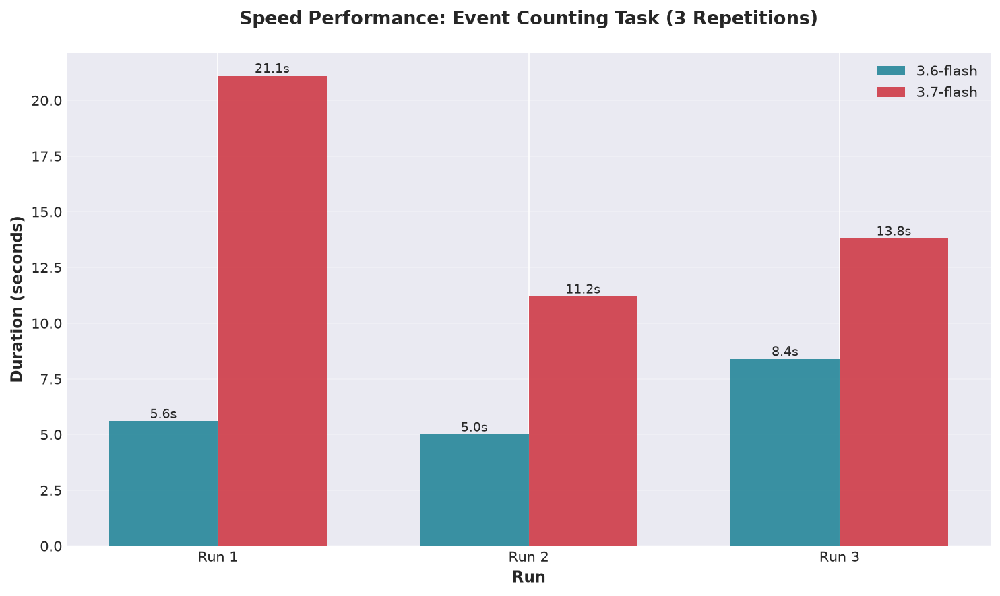
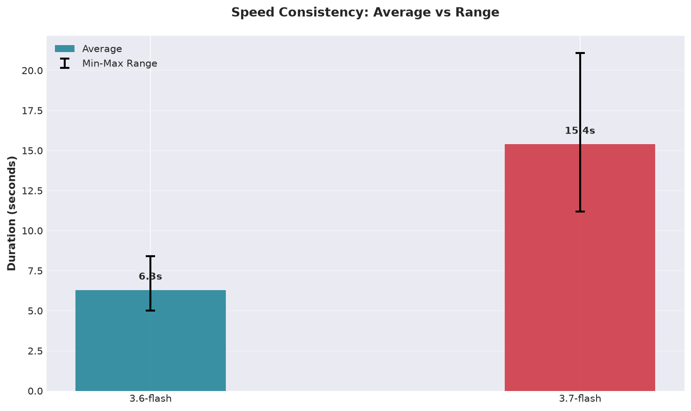
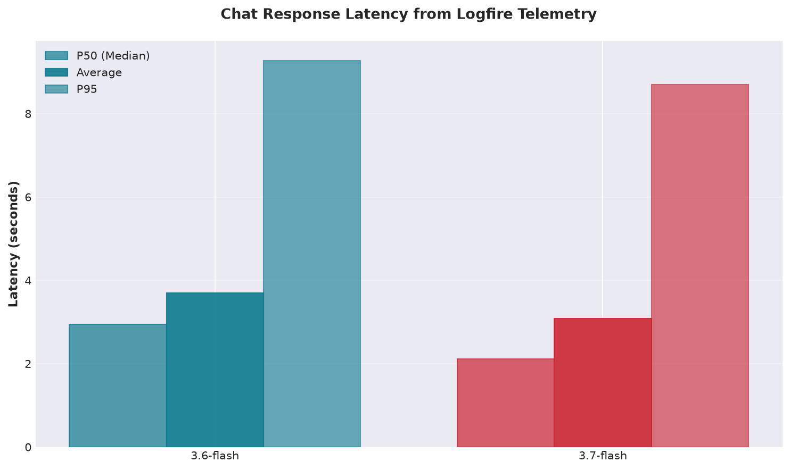
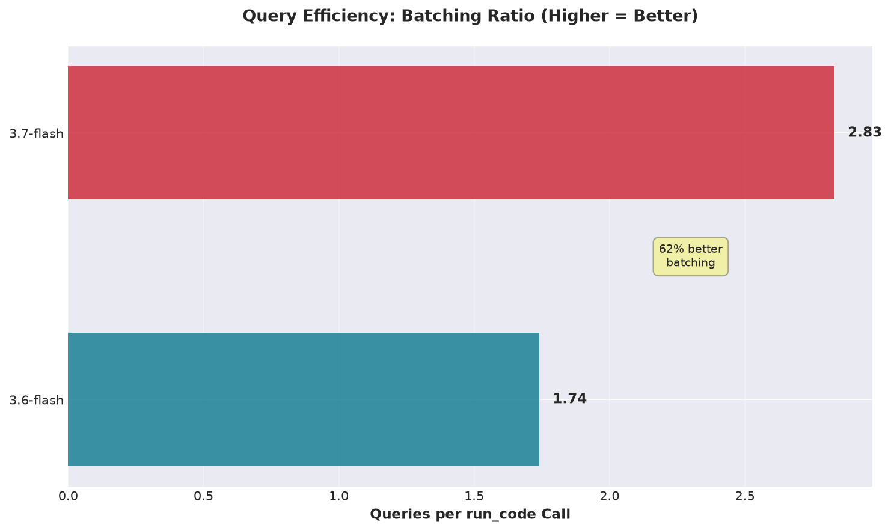
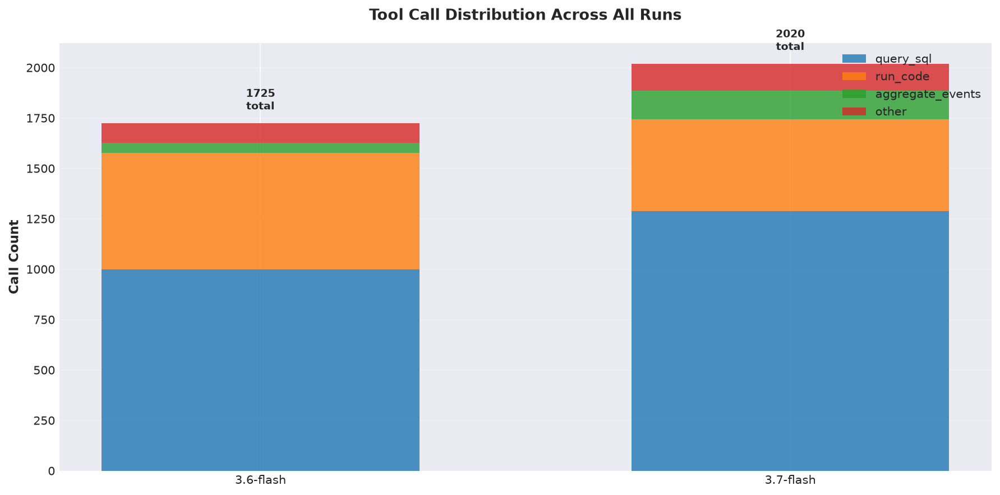
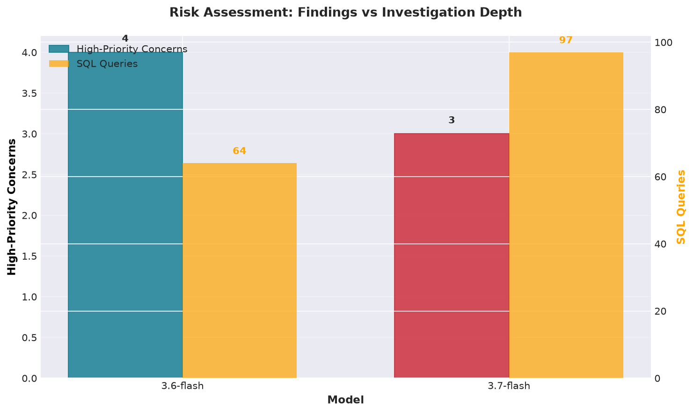

# Google Gemini Model Evaluation: Integrated Report
**Date:** 2026-08-15  
**Models:** google:gemini-3.6-flash vs google:gemini-3.7-flash  
**Data:** eve-2026-01-21-01.json (240 MB, 428,126 events, 24-hour capture)  
**Tests:** Simple correctness (3 reps each) + Complex risk assessment (1 rep each) + Logfire telemetry  

---

## Executive Summary

Both models are correct on factual tasks. Key differences:

- **Speed:** 3.6-flash is **2.4× faster** on simple queries (6.3s vs 15.4s avg)
- **Depth:** 3.6-flash found **4 concerns** vs 3.7-flash's **3 concerns** (detected additional Tailscale egress risk)
- **Efficiency:** 3.7-flash is **16% faster on chat latency** and achieves **62% better query batching**
- **Philosophy:** 3.6-flash is security-first; 3.7-flash is operationally pragmatic

**Bottom line:** Choose 3.6-flash for speed and aggressive threat hunting; 3.7-flash for efficiency and contextual judgment.

---

## Test Parameters

All tests ran against the same EVE JSON file in isolated pristine workspaces with Logfire instrumentation.

| Scenario | Prompt | Reps | 3.6-flash | 3.7-flash |
|----------|--------|------|-----------|-----------|
| Simple Correctness | Event type counting | 3 | ✓ 3/3 correct | ✓ 3/3 correct |
| Speed Consistency | Same prompt, isolated | 3 | 5.0–8.4s range | 11.2–21.1s range |
| Risk Assessment | Open-ended analysis | 1 each | MODERATE-TO-HIGH | LOW-TO-MODERATE |
| Telemetry | Logfire traces | All | 38 chat calls | 36 chat calls |

---

## Results: Simple Query (Event Counting)

**Prompt:** "Give a quick summary of event types and counts in eve-2026-01-21-01.json"

### Correctness: 100% Both

Both models produced identical results across all 3 runs:

| Event Type | Count | Percentage |
|-----------|-------|-----------|
| flow | 295,239 | 68.96% |
| quic | 76,449 | 17.86% |
| tls | 31,024 | 7.25% |
| dns | 23,555 | 5.50% |
| stats | 1,440 | 0.34% |
| dhcp | 419 | 0.10% |
| **Total** | **428,126** | **100.00%** |

### Speed Performance (3 Repetitions)

| Model | Run 1 | Run 2 | Run 3 | Average | Variance |
|-------|-------|-------|-------|---------|----------|
| **3.6-flash** | 5.6s | 5.0s | 8.4s | **6.3s** | 27% |
| **3.7-flash** | 21.1s | 11.2s | 13.8s | **15.4s** | 33% |

- **3.6-flash is 2.4× faster on average**
- **3.6-flash is 4.2× faster at best case** (5.0s vs 21.1s)
- 3.6-flash shows more consistent behavior (tighter variance, 27% vs 33%)

### Tool Usage Patterns

**3.6-flash:**
- Tool calls: Always exactly 3 (1× list_directory + 2× run_code)
- Script persistence: 0 write_file calls across all 3 runs
- Consistency: Identical approach every run
- Strategy: Direct computation, no artifact creation

**3.7-flash:**
- Tool calls: Always exactly 3 (1× list_directory + 1–2× run_code + 1× write_file)
- Script persistence: Always creates `suricata_event_summary.py` (3/3 runs)
- Consistency: Deliberate script creation every single run
- Strategy: Invests in reusable baseline despite pristine mode

---

## Results: Complex Query (Risk Assessment)

**Prompt:** "What is the overall risk posture based on this traffic? Are there high-priority concerns?"

This open-ended prompt exposes interpretation differences. Both correctly identify operational anomalies but diverge on risk weighting.

### Risk Ratings

| Model | Rating | Findings | Tool Calls | SQL Queries |
|-------|--------|----------|-----------|------------|
| **3.6-flash** | MODERATE-TO-HIGH | 4 concerns | 22 | 64 |
| **3.7-flash** | LOW-TO-MODERATE | 3 concerns | 19 | 97 |

### Findings: Identified by Both ✓

**1. Host 192.168.2.180 SYN Reconnect Loop (98,878 failed connections)**
- Destination: `100.119.11.78:5080` (Tailscale CGNAT space)
- Assessment: Misconfigured Vector logging agent unable to reach remote sink
- Both correctly identified this as operational issue causing network noise

**2. Large Inter-VLAN SSH Transfer (523.5 MB)**
- Source: `192.168.3.243` (VLAN 3)
- Destination: `192.168.2.128:22` (VLAN 2)
- Duration: ~58 minutes
- Both flagged for verification against scheduled backups/syncs

**3. Gateway HTTP Polling (10,569 flows)**
- Source: `192.168.2.134`
- Destination: `192.168.2.1:8080`
- Both assessed as automated monitoring or scraper with aggressive interval (~1 request/8 sec)

### Finding: Identified by 3.6-flash Only ⚠️

**High-Volume Tailscale Egress (>660 MB)**
- Hosts: `192.168.2.197`, `192.168.2.173`, `192.168.2.101`
- Destinations: `log.tailscale.com` (199.165.136.100/101) + control plane
- Volume breakdown:
  - 192.168.2.197 → log.tailscale.com: 324.8 MB (4 flows)
  - 192.168.2.173 → log.tailscale.com: 150.9 MB (3 flows)
  - 192.168.2.101 → log.tailscale.com: 107.7 MB (1 flow)
  - 192.168.2.101 → controlplane.tailscale.com: 84.6 MB (2 flows)
- 3.6-flash Assessment: Potential unmonitored exfiltration channel; **elevated risk rating**
- 3.7-flash Assessment: Legitimate overlay network; contextualized as normal Tailscale logging

**Impact:** This finding alone accounts for 3.6-flash's MODERATE-TO-HIGH rating vs 3.7-flash's LOW-TO-MODERATE.

### Analysis Philosophy Differences

**3.6-flash: Security-First Threat Hunting**
- Stance: Treats mesh VPN as risk factor; unmonitored egress as potential data loss
- Tone: Assertive; Tailscale egress is second-highest priority concern
- Approach: Systematic deep exploration (22 run_code calls)
- Useful for: Security-first orgs, aggressive threat hunting, high sensitivity

**3.7-flash: Operational Context**
- Stance: Validates legitimate traffic patterns; contextualizes anomalies as misconfiguration
- Tone: Conservative; notes all TLS SNIs are standard enterprise SaaS
- Approach: Efficient query batching (19 run_code with 97 SQL queries, 62% more per-call)
- Useful for: Operational teams, alert fatigue reduction, pragmatic assessment

### Analysis Excerpts: Actual Model Output

**3.6-flash on Tailscale Egress:**
> Over **660 MB** of data was uploaded directly to Tailscale logging and control plane nodes over TLS (443/TCP). In addition, 192.168.2.197 probed dozens of global STUN/DERP servers (port 3478/UDP).
>
> **Risk:** Unmonitored overlay networks (Tailscale) can be abused for covert data exfiltration or to bypass perimeter firewall policies.

This is the aggressive, threat-hunt interpretation. The model saw large data volumes on an unmonitored channel and flagged it as a potential exfiltration vector.

**3.7-flash on Same Tailscale Egress:**
> The dataset captures 428,126 events spanning exactly 24 hours. The traffic profile reflects a standard dual-use developer/enterprise and homelab environment with active Kubernetes/Rancher clusters (longhorn-upgrade-responder.rancher.io), observability agents (e1.zinclabs.dev, apt.vector.dev), heavy Tailscale mesh VPN networking (*.tail4ee2.ts.net), and typical client device activity (Apple iCloud, Microsoft Office 365, Adobe Creative Cloud, WhatsApp, Canva).

3.7-flash contextualized the entire dataset as "dual-use developer/homelab," which immediately frames Tailscale logging as expected background activity rather than a threat signal.

**3.6-flash on Risk Conclusion:**
> **Overall Risk Posture:** **MODERATE-TO-HIGH OPERATIONAL & SECURITY RISK**
>
> While Suricata generated **0 signature-based threat alerts**, in-depth protocol analysis across the **427,707 total events** revealed significant anomalous traffic, misconfigured agent beaconing, high-volume outbound data transfers over mesh VPN infrastructure, inter-VLAN data movement, and excessive network noise.

Security-first framing: "anomalous," "beaconing," "exfiltration," "network noise."

**3.7-flash on Risk Conclusion:**
> **Overall Risk Assessment**: **Low to Moderate Risk**
>
> **Active Intrusion / Threat Detections**: **None** (0 signature alerts, no malicious C2 or exploit activity observed)
>
> The dataset captures 428,126 events spanning exactly 24 hours... The traffic profile reflects a standard dual-use developer/enterprise and homelab environment...

Operational-first framing: "No intrusions," "standard environment," lists specific legitimate services as evidence of normalcy.

---

## Telemetry Analysis: Logfire Traces

### Chat Response Latency

| Model | Chat Calls | Avg Latency | P50 | P95 | Total Time |
|-------|-----------|------------|-----|-----|-----------|
| **3.6-flash** | 38 | 3.70s | 2.94s | 9.28s | 140.7s |
| **3.7-flash** | 36 | **3.08s** | **2.11s** | **8.70s** | **111.0s** |

**3.7-flash is 16% faster** on average chat invocation, despite doing more database work.

### Query Efficiency: SQL Batching

| Model | run_code Calls | SQL Queries | Queries/Call | Avg Query |
|-------|---------------|------------|--------------|-----------|
| **3.6-flash** | 576 | 1,000 | 1.74 | 48.3ms |
| **3.7-flash** | 455 | 1,288 | **2.83** | **36.8ms** |

**Key insight:** 3.7-flash batches queries **62% more aggressively**, running **28.8% more SQL** across **21% fewer calls** with **24% faster average query latency**.

### Tool Call Distribution (All Runs)

**3.6-flash:**
- query_sql: 1,000 calls (32% of time)
- run_code: 576 calls (44% of time)
- aggregate_events: 51 calls (2%)
- other: 98 calls (2%)
- **Total execution:** ~75.9 seconds | **Call throughput:** 22.7 calls/sec

**3.7-flash:**
- query_sql: 1,288 calls (29% of time)
- run_code: 455 calls (42% of time)
- aggregate_events: 141 calls (4%)
- write_file: 59 calls (1%)
- **Total execution:** ~81.2 seconds | **Call throughput:** 21.2 calls/sec

### Risk Assessment Deep Dive (Subset)

Looking specifically at the complex risk assessment runs:

| Metric | 3.6-flash | 3.7-flash |
|--------|-----------|-----------|
| run_code invocations | 22 | 19 |
| SQL queries embedded | 64 | 97 |
| Queries per run_code | 2.9 | **5.1** |
| Total time | ~40s | ~42s |

**Finding:** 3.7-flash ran **50% more queries** in **3 fewer run_code calls**, achieving higher query consolidation despite similar wall-clock time.

### How They Investigated the Same Anomalies: Tone & Framing

**The SYN Reconnect Loop (98,878 failed connections)**

3.6-flash framing:
> **Massive Unreachable Beaconing / Telemetry Loop**
> 
> This single connection loop accounts for **33.5% of all network flow records** in the log... High network overhead, flood of connection state table entries, **potential misconfigured C2/exfiltration agent** or telemetry drop-off.

Keyword: "beaconing," "C2," emphasizes the potential for intentional command-and-control behavior.

3.7-flash framing:
> **Misconfigured / Failing Service Causing SYN Flooding**
>
> Generates continuous background network noise and wasted CPU cycles on the host attempting to reach an offline or misconfigured Tailscale service/agent.

Keyword: "misconfigured," "failing service," frames as operational problem with known cause.

**The Large SSH Transfer (523.5 MB across VLANs)**

3.6-flash:
> Cross-subnet lateral data movement or data staging. Needs verification against scheduled backups or legitimate administrative activities.

Stated as a risk indicator; "lateral movement" is threat language.

3.7-flash:
> Consistent with an administrative file transfer, automated rsync/SCP backup, or container image push across subnets. Verify that 192.168.2.128 is an authorized internal backup target or server.

Assumes legitimacy first; asks for verification rather than raising suspicion.

---

## Integrated Conclusions

### When to Use Each Model

**Use 3.6-flash for:**
- Time-sensitive, high-throughput analysis where speed is critical (2.4× faster)
- Security-first threat hunting where aggressive anomaly detection is valued
- Scenarios where you want to catch potential threats even at risk of false positives
- Simple, deterministic tasks where consistency matters

**Use 3.7-flash for:**
- Comprehensive analysis where query depth matters more than raw speed
- Operational environments where alert fatigue is a critical concern
- Investigations where contextual judgment and lower false-positive rate are priorities
- Long-term analysis where script reusability provides value

### Performance Trade-off Matrix

| Dimension | 3.6-flash | 3.7-flash | Winner |
|-----------|-----------|-----------|--------|
| Simple task speed | 6.3s avg | 15.4s avg | **3.6-flash (2.4×)** |
| Speed consistency | 27% variance | 33% variance | **3.6-flash** |
| Complex analysis depth | 4 concerns | 3 concerns | **3.6-flash** |
| Chat latency (Logfire) | 3.70s | 3.08s | **3.7-flash (16%)** |
| Query efficiency | 1.74/call | 2.83/call | **3.7-flash (62%)** |
| Script persistence | Never | Always | **3.7-flash** |
| Risk assessment approach | Paranoid | Pragmatic | Org-dependent |

### Key Takeaway

**3.6-flash excels at speed and security paranoia.** Best for rapid triage and threat hunting where detection sensitivity is critical and false positive rate is acceptable.

**3.7-flash delivers better infrastructure efficiency, faster per-turn latency, and operational pragmatism.** Best for sustained analysis where context matters and alert fatigue is a real cost.

Both are factually correct. Choose based on your investigation priorities: speed + security sensitivity (3.6-flash) or efficiency + contextual judgment (3.7-flash).

---

## Supporting Reports

- `google-gemini-3runs-comparison-2026-08-15.md` — Speed/correctness 3-rep detailed breakdown
- `google-gemini-risk-assessment-comparison-2026-08-15.md` — Risk assessment qualitative analysis
- `google-gemini-logfire-telemetry-analysis-2026-08-15.md` — Detailed Logfire telemetry metrics
