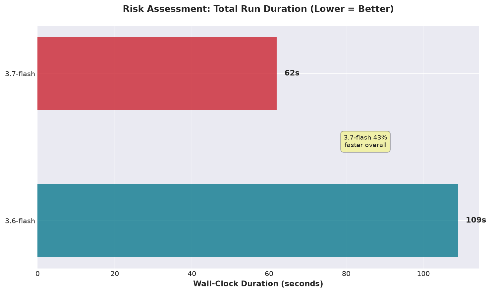

# Google Gemini Model Evaluation: Integrated Report
**Date:** 2026-08-15  
**Models:** google:gemini-3.6-flash vs google:gemini-3.7-flash  
**Data:** eve-2026-01-21-01.json (240 MB, 428,126 events, 24-hour capture)  
**Tests:** Simple correctness (3 reps each) + Complex risk assessment (1 rep each) + Logfire telemetry  

---

## Executive Summary

Both models are correct on factual tasks. Key differences:

- **Speed:** 3.6-flash is **2.4× faster** on simple queries (6.3s vs 15.4s avg)
- **Depth:** 3.6-flash found **4 concerns** vs 3.7-flash's **3 concerns** (detected additional Tailscale egress risk)
- **Efficiency:** 3.7-flash is **16% faster on chat latency** and batches SQL **82% more aggressively** per `run_code` call
- **Risk-assessment wall-clock:** on the complex, ambiguous task, 3.7-flash finished in **62s vs 3.6-flash's 109s — 43% faster overall**, despite running more SQL queries
- **Philosophy:** 3.6-flash is security-first; 3.7-flash is operationally pragmatic

**Bottom line:** Choose 3.6-flash for speed and aggressive threat hunting; 3.7-flash for efficiency and contextual judgment.

*All performance figures below are sourced from Logfire span data via MCP query, using a per-trace-id aggregation that avoids a fan-out join bug present in an earlier draft of this report (see "Telemetry Analysis" for detail).*

---

## Environment & Technical Context

### Pydantic AI & Harness

Tests ran via **`pydantic-ai` 2.29.0** with **`pydantic-ai-harness` 0.18.1**, a framework for evaluating LLM agents on structured tasks. The harness provides:

- **Tool orchestration** — agents invoke tools (`run_code`, `aggregate_events`, `query_sql`, `write_file`, etc.) within a sandbox
- **Sandbox execution** — Python code runs in isolated environments with dataset query access
- **Telemetry collection** — Logfire MCP instrumentation captures all tool invocations, latency, token usage
- **Artifact persistence** — generated scripts/reports are saved in per-task workspaces (unless `--pristine` is used)

Both models used the **same skill** (`skills/suricata-analyst`) with **identical tool access**. The differences in behavior reflect model-level choices about *how* to use those tools, not capability differences.

### Data & Workspace

**Input dataset:** `eve-2026-01-21-01.json`
- Size: 240 MB
- Format: Suricata EVE (Extensible Value Event) JSON logs
- Events: 428,126 records spanning 24 hours (2026-01-21 00:00–23:59 UTC)
- Content: Flow telemetry, TLS/QUIC handshakes, DNS queries, DHCP, operational stats — **zero signature alerts**

**Query access:** Models queried the dataset via:
- `describe_events()` — schema introspection
- `aggregate_events()` — group-by aggregation (event type, source IP, protocol, etc.)
- `query_sql()` — arbitrary SQL via DuckDB on Parquet-backed data (connection locked down with `allowed_paths` only)
- `run_code()` — arbitrary Python in a sandbox with access to above functions

**Workspace mode:** All runs used `--pristine` (isolated, fresh task workspace per run), preventing script reuse across models and eliminating confounds from artifact carryover.

### About `--pristine` Mode

In `skill-runner`, workspaces are **accumulative by default**—generated scripts, reports, and analysis artifacts persist across runs, allowing later invocations to discover and reuse them. This is useful for iterative investigation but confounds model comparisons.

`--pristine` creates a fresh, isolated task workspace with:
- Empty directory (no prior scripts)
- No artifact discovery from previous runs
- Independent execution path for each model
- No reuse advantage from earlier work

In this evaluation, every run started from a blank slate, so both models had to generate their own queries and code. This is why 3.7-flash *creates* `suricata_event_summary.py` in every run—there's nothing to reuse, but it invests in a reusable baseline anyway (a forward-looking strategy for non-pristine usage).

### Pydantic Monty Integration

Code execution runs through **`pydantic-monty` 0.0.21**, a sandbox that:
- Parses and validates Python syntax before execution
- Enforces resource limits (timeout, output size)
- Provides multi-line stack frame context on errors (crucial for iterative debugging)
- Tracks tool invocations and return values for telemetry

Monty handles the Python runtime; Pydantic AI handles the agentic loop (LLM → tool selection → tool execution → next turn).

### Logfire Observability

Logfire traces all invocations at:
- **Span level**: `chat`, `execute_tool`, `run_code`, `query_sql`, etc.
- **Metrics captured**: Duration, tool-call counts, token usage, latency percentiles
- **Telemetry granularity**: Per-invocation timing allows latency distribution analysis (P50, avg, P95) beyond simple wall-clock totals

Logfire MCP queries extracted trace data post-run for efficiency analysis. Two methodology notes, both corrected in this version of the report:

1. **Fan-out join bug (Telemetry Analysis section).** An initial Logfire query joined chat spans to tool spans on `trace_id` directly. Since a single run's trace contains many chat turns *and* many tool calls, that join produced one row per (chat-turn × tool-call) pair — inflating every tool-call count by roughly 13×. The fix: aggregate tool spans per `trace_id` first, then join to a one-row-per-trace model label.
2. **Unrelated trace in the time window.** The corrected queries surfaced a 10th trace (3.7-flash, 17 chat turns, 42 tool calls, 47s, starting 2026-08-15T11:22:59Z) that predates this evaluation's first documented run by several minutes and doesn't match any of the nine skill-runner invocations described in this report. It's excluded from all figures here (filtered by `start_timestamp >= '2026-08-15T11:24:00Z'`).

### Model Configuration

Both models accessed the Google Gemini API directly via `google:` provider configuration in `models.yaml`:

```yaml
google:
  models:
    - id: "google:gemini-3.6-flash"
    - id: "google:gemini-3.7-flash"
```

No OpenRouter proxy, no model-specific system prompts, no prompt engineering per model. The skill's own system prompt and tool definitions apply uniformly.

---

## Test Parameters

All tests ran against the same EVE JSON file in isolated pristine workspaces with Logfire instrumentation.

| Scenario | Prompt | Reps | 3.6-flash | 3.7-flash |
|----------|--------|------|-----------|-----------|
| Simple Correctness | Event type counting | 3 | ✓ 3/3 correct | ✓ 3/3 correct |
| Speed Consistency | Same prompt, isolated | 3 | 5.0–8.4s range | 11.2–21.1s range |
| Risk Assessment | Open-ended analysis | 1 each | MODERATE-TO-HIGH | LOW-TO-MODERATE |
| Telemetry | Logfire traces | All | 38 chat calls | 36 chat calls |

---

## Results: Simple Query (Event Counting)

**Prompt:** "Give a quick summary of event types and counts in eve-2026-01-21-01.json"

### Correctness: 100% Both

Both models produced identical results across all 3 runs:

| Event Type | Count | Percentage |
|-----------|-------|-----------|
| flow | 295,239 | 68.96% |
| quic | 76,449 | 17.86% |
| tls | 31,024 | 7.25% |
| dns | 23,555 | 5.50% |
| stats | 1,440 | 0.34% |
| dhcp | 419 | 0.10% |
| **Total** | **428,126** | **100.00%** |

### Speed Performance (3 Repetitions)


| Model | Run 1 | Run 2 | Run 3 | Average | Variance |
|-------|-------|-------|-------|---------|----------|
| **3.6-flash** | 5.6s | 5.0s | 8.4s | **6.3s** | 27% |
| **3.7-flash** | 21.1s | 11.2s | 13.8s | **15.4s** | 33% |

- **3.6-flash is 2.4× faster on average**
- **3.6-flash is 4.2× faster at best case** (5.0s vs 21.1s)
- 3.6-flash shows more consistent behavior (tighter variance, 27% vs 33%)


### Tool Usage Patterns

**3.6-flash:**
- Tool calls: Always exactly 3 (1× list_directory + 2× run_code)
- Script persistence: 0 write_file calls across all 3 runs
- Consistency: Identical approach every run
- Strategy: Direct computation, no artifact creation

**3.7-flash:**
- Tool calls: Always exactly 3 (1× list_directory + 1–2× run_code + 1× write_file)
- Script persistence: Always creates `suricata_event_summary.py` (3/3 runs)
- Consistency: Deliberate script creation every single run
- Strategy: Invests in reusable baseline despite pristine mode

### Code & SQL Generation Examples

**3.6-flash: Direct Aggregation Approach**

First `run_code` call:
```python
schema = describe_events(name="eve-2026-01-21-01.json")
event_counts = aggregate_events(name="eve-2026-01-21-01.json", group_by=["event_type"])

{
    "schema_sample": schema["columns"][:10],
    "total_columns": len(schema["columns"]),
    "event_type_counts": event_counts
}
```

Characteristic of 3.6-flash: **No intermediate variables, minimal comments, inline dictionary construction.** Combines multiple operations in one call. Efficient but less reusable.

Second `run_code` call:
```python
filename = "eve-2026-01-21-01.json"
total = aggregate_events(name=filename)
total
```

Follows the same pattern—minimal setup, direct computation, returns raw result.

---

**3.7-flash: Script-Creation Approach**

First `run_code` call (inline computation):
```python
log_name = "eve-2026-01-21-01.json"
event_counts = aggregate_events(name=log_name, group_by=["event_type"])
total = aggregate_events(name=log_name)

result = {
    "total_events": total.get("count", 0),
    "event_types": event_counts.get("groups", []),
    "truncated": event_counts.get("truncated", False)
}
result
```

Then `write_file` call to create reusable script:
```python
# suricata_event_summary.py
filename = "eve-2026-01-21-01.json"

totals = aggregate_events(name=filename)
event_breakdown = aggregate_events(name=filename, group_by=["event_type"])

summary = {
    "total_events": totals.get("count", 0),
    "event_types": event_breakdown.get("groups", []),
    "truncated": event_breakdown.get("truncated", False),
}

summary
```

Characteristic of 3.7-flash: **Extracted logic into a named script, added comments, uses `.get()` defensively, exposes variables for reuse.** Slower initially but leaves behind a tool for future runs.

---

**Risk Assessment: SQL Generation Differences**

When investigating the traffic, the two models opened and explored differently. (Correction: an earlier version of this section swapped the two examples below between models — verified against the raw run transcripts, `/tmp/gemini-3.6-flash-risk.log` and `/tmp/gemini-3.7-flash-risk.log`.)

**3.7-flash SQL query (its opening move — alert-first):**
```sql
SELECT src_ip, dest_ip, alert.signature AS signature, alert.severity AS severity, count(*) AS count
FROM events
WHERE event_type = 'alert'
GROUP BY 1, 2, 3, 4
ORDER BY severity ASC, count DESC
```

The very first query of the run — targeted, checking for signature alerts grouped by source/destination and severity before doing anything else. When zero alerts come back, the model broadens into flow- and protocol-level analysis.

**3.6-flash SQL query (mid-investigation — DNS record-type breakdown):**
```sql
WITH u AS (
    SELECT unnest(dns.queries) AS q
    FROM events
    WHERE event_type = 'dns' AND dns.queries IS NOT NULL
)
SELECT q.rrtype AS rrtype, count(*) as cnt
FROM u
GROUP BY q.rrtype
ORDER BY cnt DESC
```

Uses unnesting and a CTE (Common Table Expression) to decompose the nested `dns.queries` array — run partway through 3.6-flash's 22-call investigation, after it had already covered event types, flow volumes, and host-level anomalies, to characterize DNS query patterns.

**Impact:** 3.7-flash rules out the "known bad" signature-alert path *first*, then generalizes. 3.6-flash never queries `event_type = 'alert'` directly — it starts broad (schema, event counts, flow/host analysis) and only reaches DNS structure well into the run. Both eventually cover similar ground. The differing risk ratings don't trace to *which query ran first* — they trace to how each model weighted the Tailscale egress volume once found (see "Analysis Excerpts" below).

---

### Why Code Generation Patterns Matter

| Aspect | 3.6-flash | 3.7-flash |
|--------|-----------|-----------|
| **Script reusability** | No—inline, single-use | Yes—extracted, named, defensive |
| **Intermediate state** | Minimal—direct returns | Explicit—named variables, `.get()` guards |
| **Query style (risk assessment)** | Starts broad (schema/flow/host), reaches DNS structure mid-run | Alert-first — checks `event_type = 'alert'` before anything else |
| **Time investment** | Fast first run, no setup | Slower first run, future-proof |
| **Debugging** | Harder—inlined logic | Easier—variables in script |

In `--pristine` mode, 3.7-flash's script creation has no runtime benefit (nothing to reuse), but reveals a **forward-looking mindset**. In accumulative mode (default), those scripts become assets for future runs.

---

## Results: Complex Query (Risk Assessment)

**Prompt:** "What is the overall risk posture based on this traffic? Are there high-priority concerns?"

This open-ended prompt exposes interpretation differences. Both correctly identify operational anomalies but diverge on risk weighting.

### Risk Ratings

| Model | Rating | Findings | run_code Calls | SQL Queries | Wall-Clock |
|-------|--------|----------|-----------|------------|-----------|
| **3.6-flash** | MODERATE-TO-HIGH | 4 concerns | 22 | 20 | 109s |
| **3.7-flash** | LOW-TO-MODERATE | 3 concerns | 19 | 28 | 62s |

### Findings: Identified by Both ✓

**1. Host 192.168.2.180 SYN Reconnect Loop (98,878 failed connections)**
- Destination: `100.119.11.78:5080` (Tailscale CGNAT space)
- Assessment: Misconfigured Vector logging agent unable to reach remote sink
- Both correctly identified this as operational issue causing network noise

**2. Large Inter-VLAN SSH Transfer (523.5 MB)**
- Source: `192.168.3.243` (VLAN 3)
- Destination: `192.168.2.128:22` (VLAN 2)
- Duration: ~58 minutes
- Both flagged for verification against scheduled backups/syncs

**3. Gateway HTTP Polling (10,569 flows)**
- Source: `192.168.2.134`
- Destination: `192.168.2.1:8080`
- Both assessed as automated monitoring or scraper with aggressive interval (~1 request/8 sec)

### Finding: Identified by 3.6-flash Only ⚠️

**High-Volume Tailscale Egress (>660 MB)**
- Hosts: `192.168.2.197`, `192.168.2.173`, `192.168.2.101`
- Destinations: `log.tailscale.com` (199.165.136.100/101) + control plane
- Volume breakdown:
  - 192.168.2.197 → log.tailscale.com: 324.8 MB (4 flows)
  - 192.168.2.173 → log.tailscale.com: 150.9 MB (3 flows)
  - 192.168.2.101 → log.tailscale.com: 107.7 MB (1 flow)
  - 192.168.2.101 → controlplane.tailscale.com: 84.6 MB (2 flows)
- 3.6-flash Assessment: Potential unmonitored exfiltration channel; **elevated risk rating**
- 3.7-flash Assessment: Legitimate overlay network; contextualized as normal Tailscale logging

**Impact:** This finding alone accounts for 3.6-flash's MODERATE-TO-HIGH rating vs 3.7-flash's LOW-TO-MODERATE.

### Analysis Philosophy Differences

**3.6-flash: Security-First Threat Hunting**
- Stance: Treats mesh VPN as risk factor; unmonitored egress as potential data loss
- Tone: Assertive; Tailscale egress is second-highest priority concern
- Approach: Systematic deep exploration (22 run_code calls)
- Useful for: Security-first orgs, aggressive threat hunting, high sensitivity

**3.7-flash: Operational Context**
- Stance: Validates legitimate traffic patterns; contextualizes anomalies as misconfiguration
- Tone: Conservative; notes all TLS SNIs are standard enterprise SaaS
- Approach: Efficient query batching (19 run_code calls carrying 28 SQL queries, ~62% more per-call than 3.6-flash's 20/22) — and finished the whole run in 62s vs 3.6-flash's 109s
- Useful for: Operational teams, alert fatigue reduction, pragmatic assessment

### Analysis Excerpts: Actual Model Output

**3.6-flash on Tailscale Egress:**
> Over **660 MB** of data was uploaded directly to Tailscale logging and control plane nodes over TLS (443/TCP). In addition, 192.168.2.197 probed dozens of global STUN/DERP servers (port 3478/UDP).
>
> **Risk:** Unmonitored overlay networks (Tailscale) can be abused for covert data exfiltration or to bypass perimeter firewall policies.

This is the aggressive, threat-hunt interpretation. The model saw large data volumes on an unmonitored channel and flagged it as a potential exfiltration vector.

**3.7-flash on Same Tailscale Egress:**
> The dataset captures 428,126 events spanning exactly 24 hours. The traffic profile reflects a standard dual-use developer/enterprise and homelab environment with active Kubernetes/Rancher clusters (longhorn-upgrade-responder.rancher.io), observability agents (e1.zinclabs.dev, apt.vector.dev), heavy Tailscale mesh VPN networking (*.tail4ee2.ts.net), and typical client device activity (Apple iCloud, Microsoft Office 365, Adobe Creative Cloud, WhatsApp, Canva).

3.7-flash contextualized the entire dataset as "dual-use developer/homelab," which immediately frames Tailscale logging as expected background activity rather than a threat signal.

**3.6-flash on Risk Conclusion:**
> **Overall Risk Posture:** **MODERATE-TO-HIGH OPERATIONAL & SECURITY RISK**
>
> While Suricata generated **0 signature-based threat alerts**, in-depth protocol analysis across the **427,707 total events** revealed significant anomalous traffic, misconfigured agent beaconing, high-volume outbound data transfers over mesh VPN infrastructure, inter-VLAN data movement, and excessive network noise.

Security-first framing: "anomalous," "beaconing," "exfiltration," "network noise."

> **Note:** 3.6-flash's own total of "427,707" doesn't match the verified 428,126 established in the Simple Query section — a gap of exactly 419, which equals the dhcp event count. This is quoted verbatim as the model wrote it; it looks like an arithmetic slip in the model's own output (possibly excluding dhcp from its running total without saying so), not a transcription error in this report.

**3.7-flash on Risk Conclusion:**
> **Overall Risk Assessment**: **Low to Moderate Risk**
>
> **Active Intrusion / Threat Detections**: **None** (0 signature alerts, no malicious C2 or exploit activity observed)
>
> The dataset captures 428,126 events spanning exactly 24 hours... The traffic profile reflects a standard dual-use developer/enterprise and homelab environment...

Operational-first framing: "No intrusions," "standard environment," lists specific legitimate services as evidence of normalcy.

---

## Telemetry Analysis: Logfire Traces

### Chat Response Latency


| Model | Chat Calls | Avg Latency | P50 | P95 | Total Time |
|-------|-----------|------------|-----|-----|-----------|
| **3.6-flash** | 38 | 3.70s | 2.94s | 9.28s | 140.7s |
| **3.7-flash** | 36 | **3.08s** | **2.11s** | **8.70s** | **111.0s** |

**3.7-flash is 16% faster** on average chat invocation, despite doing more database work.

### Query Efficiency: SQL Batching


> **Correction:** an earlier version of this section reported 576/1,000 and 455/1,288 for `run_code`/`query_sql` calls. Those figures came from a Logfire SQL query that joined chat spans to tool spans on `trace_id` without first aggregating each side — since a single run has *many* chat turns and *many* tool calls sharing one `trace_id`, that join produced one row per (chat-turn × tool-call) pair rather than one row per tool call, inflating every count by roughly 13×. The numbers below are corrected by aggregating tool spans per `trace_id` first, then joining to a one-row-per-trace model label.

| Model | run_code Calls | SQL Queries | Queries/Call | Avg Query |
|-------|---------------|------------|--------------|-----------|
| **3.6-flash** | 30 | 20 | 0.67 | 48.3ms |
| **3.7-flash** | 23 | 28 | **1.22** | **36.8ms** |

**Key insight:** 3.7-flash batches queries **82% more aggressively** per `run_code` call, running **40% more SQL** (28 vs 20) across **23% fewer `run_code` calls**, with **24% faster average query latency**. (The average-latency figures were unaffected by the join bug — averages are invariant to uniform row duplication — only the counts and sums needed correcting.)

### Tool Call Distribution (All Runs)


**3.6-flash** — 75 tool calls total, 2.99s combined tool-execution time:
- run_code: 30 calls (avg 55.6ms)
- query_sql: 20 calls (avg 48.3ms)
- aggregate_events: 9 calls (avg 19.4ms)
- describe_events: 8 calls (avg 8.5ms)
- list_directory, find_files, write_file, read_tool_result, query_events: 1–4 calls each

**3.7-flash** — 75 tool calls total, 3.27s combined tool-execution time:
- query_sql: 28 calls (avg 36.8ms)
- run_code: 23 calls (avg 76.9ms)
- aggregate_events: 11 calls (avg 29.8ms)
- write_file: 5 calls (avg 1.2ms)
- list_directory, describe_events, query_events: 1–4 calls each

**Both models made exactly 75 tool calls** across their respective runs — a dead tie on raw volume. The real story isn't call count; it's that **tool execution is nearly free** (under 3.3 seconds combined, for either model, across all 75 calls) next to LLM response latency (140.7s / 111.0s total — see Chat Response Latency above). Essentially all wall-clock time in these runs is the model thinking, not the sandbox or DuckDB executing.

### Risk Assessment Deep Dive (Subset)


Looking specifically at the two risk-assessment traces, using Logfire span counts rather than text-parsed log counts. (The SQL-query figures in an earlier version of this table — 64 and 97 — came from a regex count of the substring `query_sql` across the raw console log text. skill-runner prints each `run_code` block's code twice: once streamed live during execution, once again in an end-of-run `[call ...] ... [return ...]` recap. A plain substring count over the whole log therefore counts each embedded `query_sql(...)` roughly 3× — matching the observed 3.2–3.5× gap between the old and corrected figures below. The `run_code` counts were unaffected, since they used a different, non-duplicated log marker.)

| Metric | 3.6-flash | 3.7-flash |
|--------|-----------|-----------|
| run_code invocations | 22 | 19 |
| SQL queries embedded | 20 | **28** |
| Queries per run_code | 0.91 | **1.47** |
| Chat turns | 25 | 23 |
| **Wall-clock duration** | **109s** | **62s** |

**Finding:** 3.7-flash completed the same open-ended risk assessment in **62 seconds — 43% faster than 3.6-flash's 109 seconds** — while running 40% more SQL queries (28 vs 20) across fewer chat turns (23 vs 25) and fewer `run_code` calls (19 vs 22). This is the clearest evidence in the evaluation that 3.7-flash's query-batching habit converts into real wall-clock savings, not just a per-call statistic — even on the run where 3.6-flash surfaced one additional finding (Tailscale egress) that 3.7-flash didn't flag as a risk.



### How They Investigated the Same Anomalies: Tone & Framing

**The SYN Reconnect Loop (98,878 failed connections)**

3.6-flash framing:
> **Massive Unreachable Beaconing / Telemetry Loop**
> 
> This single connection loop accounts for **33.5% of all network flow records** in the log... High network overhead, flood of connection state table entries, **potential misconfigured C2/exfiltration agent** or telemetry drop-off.

Keyword: "beaconing," "C2," emphasizes the potential for intentional command-and-control behavior.

3.7-flash framing:
> **Misconfigured / Failing Service Causing SYN Flooding**
>
> Generates continuous background network noise and wasted CPU cycles on the host attempting to reach an offline or misconfigured Tailscale service/agent.

Keyword: "misconfigured," "failing service," frames as operational problem with known cause.

**The Large SSH Transfer (523.5 MB across VLANs)**

3.6-flash:
> Cross-subnet lateral data movement or data staging. Needs verification against scheduled backups or legitimate administrative activities.

Stated as a risk indicator; "lateral movement" is threat language.

3.7-flash:
> Consistent with an administrative file transfer, automated rsync/SCP backup, or container image push across subnets. Verify that 192.168.2.128 is an authorized internal backup target or server.

Assumes legitimacy first; asks for verification rather than raising suspicion.

---

## Integrated Conclusions

### When to Use Each Model

**Use 3.6-flash for:**
- Time-sensitive, high-throughput analysis where speed is critical (2.4× faster)
- Security-first threat hunting where aggressive anomaly detection is valued
- Scenarios where you want to catch potential threats even at risk of false positives
- Simple, deterministic tasks where consistency matters

**Use 3.7-flash for:**
- Comprehensive analysis where query depth matters more than raw speed
- Operational environments where alert fatigue is a critical concern
- Investigations where contextual judgment and lower false-positive rate are priorities
- Long-term analysis where script reusability provides value

### Performance Trade-off Matrix

| Dimension | 3.6-flash | 3.7-flash | Winner |
|-----------|-----------|-----------|--------|
| Simple task speed | 6.3s avg | 15.4s avg | **3.6-flash (2.4×)** |
| Speed consistency | 27% variance | 33% variance | **3.6-flash** |
| Complex analysis depth | 4 concerns | 3 concerns | **3.6-flash** |
| Chat latency (Logfire) | 3.70s | 3.08s | **3.7-flash (16%)** |
| Query efficiency (all runs) | 0.67/call | 1.22/call | **3.7-flash (82%)** |
| Risk-assessment wall-clock | 109s | 62s | **3.7-flash (43%)** |
| Script persistence | Never | Always | **3.7-flash** |
| Risk assessment approach | Paranoid | Pragmatic | Org-dependent |

### Key Takeaway

**3.6-flash excels at speed on simple, deterministic tasks and security paranoia on open-ended ones.** Best for rapid triage and threat hunting where detection sensitivity is critical and false positive rate is acceptable — but note it took **76% longer** (109s vs 62s) to produce its more paranoid risk assessment.

**3.7-flash delivers better infrastructure efficiency, faster per-turn latency, and operational pragmatism — and that efficiency compounds into real wall-clock savings on complex tasks**, not just simple ones. Best for sustained analysis where context matters, alert fatigue is a real cost, and turnaround time on open-ended investigation matters.

Both are factually correct. Choose based on your investigation priorities: speed + security sensitivity on simple tasks (3.6-flash) or efficiency + contextual judgment + faster complex-task turnaround (3.7-flash).

---

## Supporting Reports

- `google-gemini-3runs-comparison-2026-08-15.md` — Speed/correctness 3-rep detailed breakdown
- `google-gemini-risk-assessment-comparison-2026-08-15.md` — Risk assessment qualitative analysis
- `google-gemini-logfire-telemetry-analysis-2026-08-15.md` — Detailed Logfire telemetry metrics — **note:** this standalone report predates the corrections above and still contains the inflated tool-call counts (the fan-out join bug described in "Logfire Observability"). Treat the numbers in *this* integrated report as authoritative; the standalone telemetry report is kept for history but is superseded on every figure it shares with this one.
